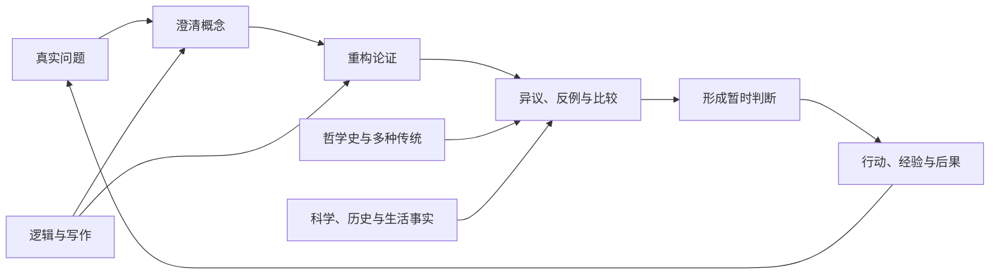

# 如何走上哲学之路：从第一性原理到独立判断

哲学之路不是一条从苏格拉底依次读到当代的书目，也不是记住一批学派、术语和名言。它真正要完成的，是把一个受习惯、情绪和时代观念支配的人，训练成能够发现前提、辨认概念、审查理由、承受异议并修正自己的人。

这条路可以压缩成一个循环：

> 从一个真实问题出发，先写下自己的答案；进入原典，重构其中最强的论证；让另一种传统和最强的反对意见来检验它；形成暂时判断；再把判断送回生活和经验，观察它解释了什么、遗漏了什么，然后重来。

完整路线由五段有终点的训练和一个终身循环构成：**定向、工具、核心问题、历史与多种传统、专题研究，以及贯穿其中的个人综合**。按每周 7—10 小时推进，大约需要三年形成第一轮闭环；此后不再是“学完哲学”，而是已经获得继续独立学习的能力。

## 一、从第一性原理确定哲学学习的目标

### 1. 人在读哲学以前，已经活在一套哲学里

每个人都在用某些未经书写的命题生活：

- 只有看得见、测得到的东西才真实吗？
- 我凭什么相信记忆、感官、专家和多数人？
- “我”是身体、意识、经历的连续，还是某种更深的主体？
- 快乐、成功、德性、爱、创造与责任，哪一种使生活值得？
- 自由意味着不受约束，还是有能力服从自己认可的理由？
- 国家为何有权命令人？不平等在什么条件下才正当？
- 死亡使一切失去意义，还是恰好赋予选择以重量？

不回答这些问题，也是一种回答。一个人可以拒绝谈论价值，却仍会用时间、金钱和注意力表明什么在他心中更重要；可以声称自己没有世界观，却仍会按照某种关于真实、成功和人的假设行动。

所以，哲学学习不是给空白头脑添加一套理论，而是把已经支配生活的隐蔽前提暴露出来。

### 2. 这些前提无法只靠信息积累解决

事实能够告诉人某种行为带来什么结果，却不能单独决定什么结果值得追求；脑科学能够描述决定形成的过程，却不能仅凭描述裁定责任是否存在；历史能够解释一种制度怎样形成，却不能因此证明它正当或不正当。

许多根本争论混合了四种不同问题：

1. **事实问题**：发生了什么，世界如何运作；
2. **概念问题**：自由、知识、人格、公平究竟指什么；
3. **推理问题**：现有理由是否真的支持结论；
4. **价值问题**：什么值得追求，什么应当被禁止。

哲学首先训练人把它们拆开，再看它们如何重新连接。

### 3. 人的判断会错，却不能因此放弃判断

感官会误导，记忆会改写，语言会含混，传统会把偶然习惯伪装成天经地义，个人欲望会替自己编造理由。怀疑因此必要。但“所有立场都不可靠”本身也是一个立场；若它没有经受同样审查，怀疑就只是逃避判断的手段。

真正的目标不是获得不可动摇的终极答案，而是建立一套更可靠的自我修正机制：知道自己为何相信，知道哪一环最脆弱，知道什么证据或论证足以改变自己。

### 4. 因而，哲学学习必须产生六种能力

| 能力 | 学成后的表现 |
|---|---|
| 发现问题 | 能从日常争执中找出真正分歧，不被表面措辞牵走 |
| 忠实理解 | 能用自己的话准确说出作者的问题、主张和理由，不把自己的意见塞给作者 |
| 概念区分 | 能发现同一个词的多种含义，说明必要条件、充分条件和边界案例 |
| 论证判断 | 能把散在文本中的推理重构成前提与结论，检查有效性、证据强度和隐藏前提 |
| 异议与比较 | 能提出击中核心的反例，呈现对手最强版本，并比较不同传统各自付出的代价 |
| 综合与修正 | 能形成清楚、暂时、可被推翻的立场，并让阅读改变判断和行动 |

读过多少书不是最终指标。能够稳定地完成这六件事，才意味着已经进入哲学。

## 二、整条路线的结构



路线必须同时沿四条轴推进：

- **问题轴**保证学习始终在追问真实、知识、自我、价值与共同生活，而不是背诵人物生平。
- **历史轴**让人看见问题为何在特定时代以特定方式出现，也防止把今天的常识投射到古人身上。
- **方法轴**训练逻辑、概念分析、解释、现象描述、谱系追问、思想实验和比较阅读。
- **输出轴**要求每一轮学习留下论证图、短文、对话记录和立场修订。没有输出，理解通常只是一种熟悉感。

四条轴不能互相代替。只读哲学史，会知道别人说过什么，却未必会思考；只谈生活感悟，会有态度，却没有足够强的理由；只练形式逻辑，会判断推理形式，却可能看不见问题从何而来；只追当代议题，又容易重演早已出现过的错误。

## 三、五段训练和一个终身循环

时间应当按有效学习小时计算，而不是按买书或翻页数量计算。

| 阶段 | 建议投入 | 核心任务 | 必须留下的成果 |
|---|---:|---|---|
| 0. 定向 | 30—40 小时 | 发现自己的问题与隐含世界观 | 一份初始世界观清单、一篇 1000—2000 字短文 |
| 1. 工具 | 100—120 小时 | 非形式逻辑、基础形式逻辑、精读与论证写作 | 12 张论证图、2 篇经过重写的短论文 |
| 2. 核心问题 | 240—320 小时 | 覆盖哲学的主要问题域 | 8—10 个问题档案、4—6 篇比较论文 |
| 3. 历史与多种传统 | 320—400 小时 | 建立全球哲学史骨架并精读锚点原典 | 7 张思想谱系图、7 篇传统内部或跨传统分析 |
| 4. 专题研究与综合 | 250—350 小时 | 进入研究文献，完成独立论证 | 一篇 5000—10000 字研究文章、一份修订后的个人哲学纲要 |
| 5. 个人综合 | 终身 | 定期审查知识、价值与生活是否一致 | 每年一个版本的个人哲学纲要 |

总量约 940—1230 小时。每周 8 小时、每年学习 46 周，约三年完成。每周只有 5 小时，就把周期拉长；不要削掉写作和复盘来制造虚假的进度。

### 阶段 0：先知道自己为何而学

第一步不是打开《纯粹理性批判》，而是建立一份思想基线。回答下面十二个问题，每题写下当前答案、主要理由、信心程度、可能推翻它的条件，以及它怎样影响生活：

1. 什么最真实？
2. 什么算作知识？
3. 人能够在多大程度上自由？
4. 自我是怎样保持同一的？
5. 什么使人生值得？
6. 快乐与价值是什么关系？
7. 人对陌生人负有什么责任？
8. 何种权力具有正当性？
9. 科学能够回答什么，不能回答什么？
10. 美与艺术有什么价值？
11. 宗教、敬畏和超越经验各自意味着什么？
12. 应当怎样面对痛苦、偶然与死亡？

这不是人格测试，而是以后衡量思想是否真正发生变化的原始记录。

入门阅读只选少量作品：托马斯·内格尔的 *What Does It All Mean?*（中译常名《你的第一本哲学书》）、柏拉图《苏格拉底的申辩》与《游叙弗伦》、再从《论语》或《庄子·内篇》中选择一部。前者提供问题地图，柏拉图展示追问怎样发生，中国原典则让人一开始就知道哲学并非只有一种书写方式和问题结构。

阶段结束时写第一篇短文，例如：“未经省察的生活是否不值得过？”文章必须有明确结论、至少两个理由、一个真正可能击败结论的异议，以及对异议的回应。

### 阶段 1：先学会看见论证

这一阶段要掌握：

- 命题、前提、结论与隐藏前提；
- 演绎、归纳、类比、溯因及其不同强度；
- 有效性、可靠性、反例、必要条件与充分条件；
- 概念歧义、循环论证、诉诸权威、错误两难等常见失误；
- 命题逻辑与一阶逻辑的基本符号化、真值表和自然演绎；
- 论证的善意原则：先把对方重构到他能够认可，再开始批评；
- 哲学短文的结构：精确论题、概念界定、论证、异议、回应和剩余代价。

逻辑是所有方法的公共底座，却不是哲学的唯一方法。第一年还要学会辨认不同方法各自在做什么：

| 方法 | 它主要追问什么 | 基础练习 |
|---|---|---|
| 苏格拉底式反诘 | 一组自以为一致的信念是否互相冲突？ | 从一个日常断言连续追问定义、理由和反例 |
| 概念分析 | 一个概念的适用条件和边界是什么？ | 为“自由”提出必要条件、充分条件和边界案例 |
| 思想实验与反思平衡 | 原则与具体判断冲突时，哪一方应当修改？ | 用电车、无知之幕或人格复制案例来回修订原则 |
| 现象学描述 | 一种经验在第一人称中如何显现？ | 在因果解释以前，精确描述一次羞耻、无聊或选择经验 |
| 解释学 | 文本、语言和历史处境如何共同产生意义？ | 比较一个段落在全书、时代争论和今天阅读中的三层意义 |
| 谱系与批判 | 一种价值或范畴怎样形成，又服务了何种权力关系？ | 追踪“成功”或“正常”的历史条件；起源解释不能单独代替真值判断 |
| 比较哲学 | 另一传统是否给出不同答案，甚至重写了原问题？ | 先分别重构两套概念，再比较其问题、论证和实践目标 |

“指出一个谬误名称”不等于完成反驳。必须说明错误发生在哪一步，以及删除或修订那一步后，结论还能否成立。

形式逻辑学到能够辨认论证结构即可。除非准备进入逻辑、语言、数学或计算哲学，不必把第一年变成符号推演训练。免费的 [*forall x: Calgary*](https://forallx.openlogicproject.org/) 足以完成基础训练；若英文成为额外障碍，选一部覆盖有效性、命题逻辑、谓词逻辑与自然演绎的可靠中文大学教材即可。教材语言不是能力指标。[Open Logic Project](https://openlogicproject.org/) 的主体材料从中级开始，适合后来深入。写作可直接使用哈佛哲学系推荐的 [*A Brief Guide to Writing the Philosophy Paper*](https://philosophy.fas.harvard.edu/sites/g/files/omnuum4436/files/phildept/files/brief_guide_to_writing_philosophy_paper.pdf)。

过关标准很简单：给出一篇 5—10 页的哲学文章，能够在不看摘要的情况下写出它的核心问题、结论、编号论证、最强异议和一种可能回应；随后写一篇 1500—2500 字文章，经过批评后完整重写一次。

### 阶段 2：按问题建立哲学的骨架

哲学首先由问题组成，学派和人物是回答这些问题的路线。下面十个问题域构成第一轮不可缺少的地图：

| 问题域 | 必须能够追问的核心问题 | 第一轮锚点文本 |
|---|---|---|
| 知识与真理 | 知识是否只是“有理由的真信念”？怀疑能走多远？证言与专家凭什么可信？ | 柏拉图《美诺》；笛卡尔《第一哲学沉思集》第一、二沉思；休谟《人类理解研究》第四、五节；Gettier 短文 |
| 实在、因果与时间 | 什么存在？原因是世界中的联系，还是心智形成的期待？事物如何保持同一？ | 亚里士多德《形而上学》第四卷选读；休谟《人类理解研究》第七节；龙树《中论》第一、二、二十四品选读 |
| 心灵、自我与意识 | 心灵能否还原为物质过程？什么使今天的我仍是昨天的我？意识为何具有第一人称性质？ | 洛克《人类理解论》第二卷第二十七章；《无我相经》；内格尔《成为一只蝙蝠可能是什么样子？》 |
| 自由与行动 | 决定有原因是否排除自由？意图何时成为行动？责任需要“本可以做别的”吗？ | 爱比克泰德《手册》第一节；斯宾诺莎《伦理学》选读；Frankfurt《不同选择的可能性与道德责任》 |
| 幸福、德性与善的生活 | 快乐、欲望满足、德性与意义谁具有优先性？好生活能否脱离共同体？ | 亚里士多德《尼各马可伦理学》第一、二、六、十卷；《论语》；《孟子》选读；伊壁鸠鲁《致美诺寇斯书》 |
| 道德与价值 | 何种行为正确？结果、规则、德性和关怀如何冲突？价值是客观的、建构的还是投射的？ | 康德《道德形而上学奠基》第一、二章；密尔《功利主义》第二、五章；尼采《道德谱系》第一篇；Anscombe《现代道德哲学》 |
| 权力、正义与共同生活 | 权威从何而来？自由与平等怎样冲突？制度如何制造支配、排斥与看不见的特权？ | 霍布斯《利维坦》第十三至十八章；卢梭《社会契约论》第一、二卷；密尔《论自由》；罗尔斯、波伏瓦、法农选读 |
| 语言、解释与理解 | 词语如何指向世界？意义来自对象、意图、使用还是生活形式？翻译是否改变问题？ | 弗雷格《论意义和指称》；维特根斯坦《哲学研究》选读；庄子“濠梁之辩”与《齐物论》选读 |
| 科学、宗教与世界图景 | 归纳为何合理？什么区分科学与非科学？神、恶与信仰之间能否相容？ | 休谟论归纳；波普尔、库恩选读；奥古斯丁《忏悔录》第十一卷；关于恶的问题的当代论证 |
| 美、技术、自然与未来 | 审美判断只是偏好吗？技术是工具还是一种看待世界的方式？人对动物、环境和未来世代负有什么责任？ | 康德《判断力批判》选读；阿伦特《人的境况》选读；海德格尔《技术的追问》；当代环境与技术伦理论文 |

这十项是主干，不是学科边界。法哲学、历史哲学、数学哲学、教育哲学、医学伦理、商业伦理、性与爱的哲学等，都是主干问题进入特定对象后的分支；在专题研究阶段按自己的生活与专业补入。

每个问题域安排三至四周，不要把表中所有文本都从头读到尾。每轮执行同一个结构：

1. 用一篇可靠导论画出争论地图；
2. 选择两部立场冲突的原典精读；
3. 加入一篇当代论文或另一传统的文本；
4. 写出自己的比较判断。

问题域完成的标志，不是“知道康德主张义务论”，而是能够回答：康德的结论依靠哪些前提？密尔会攻击哪一个？两者分别解释了什么、牺牲了什么？哪一种现实案例最能暴露它们的边界？

### 阶段 3：建立多条历史主干

按问题入门之后，再系统学习历史。这样遇见一个体系时，知道它试图解决什么，而不会把哲学史读成人名与观点的年表。

七条主干都要进入；每条先用约五周建立骨架，第三年再选择两条薄弱主干各加三周。每条选择两部锚点作品精读，其余通过选段和可靠研究建立背景。

| 主干 | 核心张力 | 建议锚点 |
|---|---|---|
| 古希腊与希腊化世界 | 自然与约定、知识与怀疑、德性与幸福、城邦与灵魂 | 柏拉图《申辩》《游叙弗伦》《理想国》选读；亚里士多德《尼各马可伦理学》；伊壁鸠鲁与爱比克泰德 |
| 中国与东亚哲学 | 礼与自然、仁与利、秩序与自由、语言与分别、修身与政治 | 《论语》《墨子》《孟子》《老子》《庄子·内篇》《荀子》；延伸至宋明理学及其东亚展开 |
| 印度与佛教哲学 | 自我与无我、知识来源、实在与空、行动与解脱、意识与语言 | 《奥义书》与《薄伽梵歌》选读；早期佛教经；《正理经》选读；龙树《中论》；吠檀多选读 |
| 基督教、伊斯兰与犹太哲学 | 理性与启示、存在与本质、时间与创造、恶、因果与神圣律 | 奥古斯丁《忏悔录》；阿维森纳《形而上学》选读；安萨里、迈蒙尼德、阿奎那选读 |
| 欧洲近代与启蒙 | 主体与世界、经验与理性、自然法、社会契约、自由与普遍理性 | 笛卡尔、斯宾诺莎、洛克、休谟、卢梭、康德 |
| 十九至二十世纪的分岔 | 历史、资本、价值重估、存在、语言、经验与实践 | 密尔、马克思、克尔凯郭尔、尼采；皮尔士与詹姆斯；弗雷格、罗素、维特根斯坦；胡塞尔、海德格尔、萨特、波伏瓦 |
| 当代与全球哲学 | 正义、殖民、性别、种族、知识权力、心智、生态与技术 | 阿伦特、法农、罗尔斯、Anscombe、Foot、Williams；Wiredu、Hountondji、Dussel；女性主义认识论、原住民与环境哲学、人工智能伦理 |

多传统阅读不是在西方主干旁边陈列“东方智慧”。同一个问题必须允许不同传统改变问题本身。例如，讨论自我时，不只是让佛教给洛克提供另一个答案，还要追问“持续存在的实体”是否从一开始就是正确的问题；讨论伦理时，也要检验把道德理解为规则选择，是否忽略了修养、关系和情感结构。

读历史文本时始终做四层工作：

1. **语境**：作者面对谁、继承什么词汇、回应什么制度与危机；
2. **内部重构**：在作者自己的概念中，论证怎样成立；
3. **真值判断**：即使理解其时代，也仍要问理由是否充分；
4. **接受史**：后人怎样改变、利用或遮蔽了这套思想。

语境不能把错误洗成正确，当代标准也不能替代理解。两种工作必须同时完成。

### 阶段 4：从学习者变成独立研究者

广度的终点不是知道得更多，而是有能力在一个窄问题上做深。选择一个会持续牵引自己的问题，再选择一个能迫使自己离开舒适区的传统或方法。例如：

- 没有自由意志，道德责任还能否成立？
- “无我”是否真的与人格连续性冲突？
- 幸福能否成为公共政策的最高指标？
- 人工智能系统可能拥有什么道德地位？
- 敬畏能否在没有人格神的世界图景中成立？
- 庄子的语言怀疑与维特根斯坦的意义观究竟在哪一点相遇、在哪一点分离？

完成一项研究按八步走：

1. 把大兴趣缩成一句可以争论的问题；
2. 用 [Stanford Encyclopedia of Philosophy](https://plato.stanford.edu/) 和 [Internet Encyclopedia of Philosophy](https://iep.utm.edu/) 建立概念与争论地图；
3. 沿百科条目的参考文献和 [PhilPapers](https://philpapers.org/) 建立 20—30 项初始书目；
4. 筛成 8—12 项核心材料，区分原典、解释性研究和争论性论文；
5. 制作研究矩阵，记录每位作者的问题、主张、方法、证据、异议与关系；
6. 写一页论证概要，明确自己的新意究竟是区分、反例、综合、解释还是应用；
7. 完成 5000—10000 字初稿，主动交给持不同立场的人批评；
8. 根据最强批评重写，而不是只润色措辞。

研究文章必须让读者清楚分辨三种声音：原作者说了什么，研究者如何解释，自己主张什么。不能用文献数量掩盖没有论点，也不能把“我觉得”伪装成原创性。

### 阶段 5：形成一套暂时的个人哲学

个人哲学不是把喜爱的名言拼成座右铭，也不是宣布归属于某个学派。它是一份公开接受修订的生活宪章，至少回答：

- 我接受什么作为可靠知识，怎样分配信任？
- 我认为人是什么，自由与责任到哪里为止？
- 哪些价值不应被舒适、效率和成功交换？
- 我对亲近者、陌生人、社会制度和未来世代各负什么责任？
- 工作、爱、创造、政治参与和独处在生活中各占什么位置？
- 当价值冲突、努力失败、痛苦无法消除时，我依据什么行动？
- 什么事实或论证会使我改变这些答案？

每年重写一次，保留旧版。真正的成长不是立场越来越坚硬，而是理由越来越清楚，矛盾越来越少，对自己可能错误的地方越来越敏感。

## 四、真正有效的学习单位：四周一个问题

书不是最小单位，问题才是。一个四周循环可以这样运行：

### 第一周：建立问题与地图

- 写下自己尚未查资料的初始答案和信心程度；
- 读一篇 SEP、IEP 或可靠教材章节；
- 列出 3—5 个主要立场及其分歧点；
- 选择两部相互冲突的原典。

### 第二周：精读第一部原典

- 标出作者要解决的问题；
- 用编号形式重构核心论证；
- 找出关键概念和最脆弱的隐藏前提；
- 用 300 字写出最强版本，不发表自己的态度。

### 第三周：让第二种声音进入

- 精读对立文本或另一传统的相关文本；
- 区分双方是在事实、概念、推理还是价值上分歧；
- 为双方各写一个最强异议和最佳回应；
- 找一个真实案例或思想实验检验两者。

### 第四周：写作与修订

- 写 1500—2500 字立场文章；
- 让读者或 AI 只负责寻找歧义、跳步、反例和未回应的异议；
- 核对所有引文与页码；
- 重写文章，并更新最初答案与信心程度。

每轮至少留下五样东西：问题卡、概念表、论证图、异议表和修订后的短文。四周结束仍说不出自己的判断，说明阅读尚未完成。

## 五、怎样精读一部艰深原典

### 第一次：只看地形

先读目录、序言、章节首尾和可靠导论。写出全书试图解决的一个主问题，以及各章在整体中的作用。第一次不追求逐句理解。

### 第二次：重构骨架

逐段标记四类内容：主张、理由、例子、异议。把散文改写成编号论证：

1. 前提一；
2. 前提二；
3. 若一与二成立，则中间结论；
4. 因而最终结论。

凡是“显然”“因此”“必然”出现的地方都要停下来，问中间是否缺了一步。

### 第三次：攻击最强版本

不要抓最笨的表述。先替作者补出合理的隐含前提，再问：

- 哪个前提最可疑？
- 推理有效但前提不真实吗？
- 是否存在真正相似的反例？
- 结论是否比论证能够支持的更强？
- 作者能够怎样修补？修补后会付出什么代价？

### 第四次：让文本改变问题

最后才问自己是否同意。更重要的是：作者是否揭示了自己原先没有看见的区分？原来的问题是否问错了？哪一条生活判断需要因此修改？

读完一本书却不能写出它的论证，等于只接触了它的句子。

## 六、如何处理中文译本与原文

哲学学习不以掌握希腊语、拉丁语、梵语或德语为入场券。先用自己真正能理解的中文把问题和论证读清楚。形式化的双语排版不会自动增加理解。

选译本时看四件事：译者是否具有相关研究背景，是否有完整导言与注释，是否保留章节或段落编号，关键术语是否前后一致。重要文本尽量准备两个独立译本；只有当某个词的译法会改变论证时，才借助词典、研究文献和原文逐句核验。

原文能力应当在专题研究阶段按需学习。研究亚里士多德再补希腊语，研究康德再补德语，远胜于为了显得严肃而同时浅学四种语言。

引用必须落到稳定版本的页码、章、节或标准编号。名言图片、短视频字幕和没有上下文的网络摘录只能充当线索，不能充当文本证据。

## 七、每周怎样安排

推荐强度是每周 8 小时：

| 活动 | 时间 | 任务 |
|---|---:|---|
| 原典精读两次 | 2 × 90 分钟 | 一次理解结构，一次重构论证 |
| 导论或研究文献 | 60 分钟 | 补背景、确认主要解释与争论 |
| 逻辑与论证训练 | 60 分钟 | 符号化、反例、概念边界或论证图 |
| 写作 | 90 分钟 | 从 300 字摘要逐步发展成短论文 |
| 对话或口头复述 | 45 分钟 | 不看笔记讲清问题、论证和异议 |
| 周复盘 | 45 分钟 | 更新信心、未决问题与下周计划 |

只有 5 小时时，保留原典 2 小时、导论 1 小时、论证重构 1 小时、写作 1 小时。最先删除额外视频和延伸阅读，最后才动写作。

每 6 周设置一周缓冲：补遗漏、重写旧文、整理概念，而不是继续增加新材料。遗忘不是意志薄弱，而是没有安排提取和复现。隔一周、一个月、三个月，分别在不看笔记的情况下重新画一次核心论证。

## 八、笔记、写作与对话的具体方法

### 一张合格的问题卡

```text
问题：
我的初始答案与信心（0—100）：
关键概念及边界：
立场 A 的最强论证：
立场 B 的最强论证：
最可能改变我判断的事实或理由：
目前结论与代价：
尚未解决的问题：
四周后的答案与信心：
```

### 一张合格的阅读卡

```text
书目与版本：
作者真正回答的问题：
核心结论：
编号论证：
关键原文与页码：
最强之处：
最脆弱的前提：
作者可能的回应：
它改变了我的哪个问题或判断：
```

### 一篇合格短论文的骨架

1. 第一段直接给出精确论题和结论；
2. 定义会影响结论的术语；
3. 用最短篇幅重构讨论对象的最强论证；
4. 给出自己的理由；
5. 提出一个足以威胁结论的异议；
6. 回应异议，并承认回应留下的真实代价；
7. 说明结论究竟证明到哪里，不把局部胜利写成终极答案。

哲学写作追求的是小而清楚的推进。一篇文章真正澄清一个歧义、击中一个前提或建立一个新联系，胜过十页宏大宣言。

### 一场合格对话的规则

- 先复述对方立场，直到对方承认“这就是我的意思”；
- 问清分歧落在事实、定义、推理还是价值排序；
- 一次只处理一个论证；
- 明说什么会改变自己的看法；
- 结束时记录自己学到了什么，而不是谁赢了。

把哲学当辩论竞技，会奖励反应速度和立场防守；把它当共同调查，才会奖励准确与修正。

## 九、怎样使用导论、课程、百科与人工智能

资源有明确分工：

1. **原典**提供需要理解和判断的对象；
2. **专业研究**提供历史语境、文本解释和当前争论；
3. **SEP、IEP 与教材**提供地图；
4. **大学课程与讲座**提供节奏、示范和讨论入口；
5. **通俗书、播客与视频**负责激发兴趣；
6. **人工智能**负责追问、生成异议、检查清晰度和模拟口试。

地图不能代替土地。先用导论定位，再进入原典，遇到困难回到研究材料，最后重新读原典。这个“导论—原典—研究—原典”循环比只啃原典或只看摘要都可靠。

人工智能应当在自己已经写出初步理解之后进入。适合交给它的问题包括：

- “把我这段话重构成编号论证，指出缺失前提。”
- “给出三个会真正威胁结论的反例，不要改写我的主张。”
- “分别以康德主义者和功利主义者的最强立场批评这篇短文。”
- “只标出概念歧义、推理跳步和证据不足，不替我改写结论。”

AI 生成的引文、页码、思想归属和文献都要回到原始来源核验。让它替自己先读、替自己判断、再把流畅文字当成理解，会使哲学最需要训练的部分直接消失。

## 十、哲学必须回到生活，但不能退化成自助术

哲学指导生活，不是每天从斯多葛主义、存在主义或佛教中挑一句让自己舒服的话。它至少要完成三次转换：

1. 从模糊困扰转成可以分析的问题；
2. 从漂亮原则转成存在冲突与代价的判断；
3. 从口头赞同转成时间、关系、工作和责任上的实际选择。

每个问题周期选择一个“生活检验”：

- 学自由时，记录一周内哪些决定由习惯、冲动、环境和理由分别推动；
- 学德性时，选择一种品质，观察它在具体关系中需要怎样的练习；
- 学认识论时，为一项重要信念建立证据链，并写下可信度；
- 学政治哲学时，追踪一个日常便利背后的制度、劳动与权力；
- 学死亡时，检查自己当前的时间分配是否与声称珍视的东西一致。

生活经验不能自动证明哲学命题，但会暴露概念是否空洞、原则是否选择性执行、理论是否遗漏人的真实处境。学术严谨与生活实践不是两条路：前者防止自我欺骗，后者防止思想变成没有对象的技术。

## 十一、一套可直接执行的三年安排

### 第一年：学会做哲学

- 5 周：完成思想基线与入门阅读；
- 12 周：非形式逻辑、基础形式逻辑、阅读与短论文；
- 27 周：完成十个核心问题域中的八个，难题允许使用四周、较熟悉的问题压缩为三周；
- 2 周：写一篇 3000—5000 字年度综合，重做十二问。

年度成果：至少 12 张论证图、8 个问题档案、6 篇短文、1 篇综合文章。

### 第二年：获得历史纵深和多种坐标

- 6 周：完成第一年尚未完成的两个核心问题域；
- 35 周：七条历史主干各完成第一轮，每条约 5 周；
- 5 周：围绕“自我”“好生活”“正义”做跨传统比较，并完成年度综合。

年度成果：补齐 10 个问题档案，完成 7 张初版谱系图、至少 5 篇文本分析和 2 篇跨传统比较。每一篇比较都先解释传统内部的问题，不能只寻找表面相似的句子。

### 第三年：进入前沿并形成自己的问题

- 6 周：回到第二年的两条薄弱主干，精读此前只读过选段的锚点作品；
- 8 周：选择两个当代领域，例如心灵与认知、环境、性别与种族、科技与人工智能；
- 23 周：完成一个主专题的研究阅读、文献矩阵与论证概要；
- 9 周：写作并两次重写 5000—10000 字研究文章，其中最后两周同时重写个人哲学纲要。

年度成果：1 个可持续研究专题、1 篇自足的长文、1 份有版本记录的个人哲学纲要。

每年预留 6 周给休息、生活事件和返工。路线能长期走下去，比用三个月制造一次阅读高潮更重要。

## 十二、从今天开始的十二周

如果不想继续准备，直接按下面开始：

| 周次 | 阅读与任务 | 输出 |
|---|---|---|
| 1 | 回答十二个基线问题；选出最牵引自己的一个 | 2000 字思想基线 |
| 2—3 | 内格尔 *What Does It All Mean?*；每章先写自己的答案 | 9 张问题卡 |
| 4 | 柏拉图《苏格拉底的申辩》 | “苏格拉底为何认为自己没有失败？”论证图 |
| 5 | 柏拉图《游叙弗伦》 | “一件事因被命令而善，还是因善而被命令？”短文 |
| 6 | 《论语》选读：学而、为政、里仁、颜渊 | “修养与规则何者优先？”问题卡 |
| 7 | 《庄子·齐物论》配一篇可靠导读 | 列出庄子改变了哪些问题前提 |
| 8 | Anthony Weston *A Rulebook for Arguments*（中译《论证是一门学问》）或同等中文教材 | 重构前六周的 3 个论证 |
| 9 | *forall x* 或中文形式逻辑教材中的有效性、命题逻辑与真值表部分 | 练习集与错题说明 |
| 10 | 笛卡尔第一、二沉思 | 怀疑论证图与最强反例 |
| 11 | 休谟《人类理解研究》第四、五节 | 归纳问题论证图 |
| 12 | 回看第 1 周，写“怀疑应当在何处停止？” | 2000—3000 字文章，至少重写一次 |

十二周后再购买下一阶段的书。书架提前三年建好，只会把选择带来的兴奋误当成学习。

## 十三、判断自己是否真的在进步

每篇重要输出按六项自评，每项 0—2 分：

| 项目 | 0 分 | 1 分 | 2 分 |
|---|---|---|---|
| 文本准确 | 误读或无出处 | 大意正确 | 能以段落和版本核验关键解释 |
| 概念清楚 | 关键词含混 | 有定义 | 能处理边界、歧义与反例 |
| 论证完整 | 只有态度 | 有理由 | 前提、推理和隐藏假设清楚 |
| 异议强度 | 没有或稻草人 | 有合理异议 | 异议足以迫使主张修改 |
| 比较能力 | 罗列观点 | 看见差异 | 能说明各立场的解释力与代价 |
| 修正能力 | 只防守原观点 | 局部修改 | 明确说明为何改变及仍不确定之处 |

总分 9 分以上且没有任何一项为 0，才进入下一轮。若“修正能力”长期为 0，学到的不是哲学，而是为既有立场寻找武器。

更可靠的长期信号是：使用的名词变少，给出的区分变准；结论的口气变窄，理由的结构变强；能更快发现自己不知道什么，也更能说明为何暂时如此判断。

## 十四、最常见的歧路

### 从第一位哲学家开始一路顺读

这会在尚未形成问题意识时消耗耐心。先按问题进入，再补历史主干；历史因此成为活的争论，而不是年表。

### 用名言和学派标签代替理解

“我是存在主义者”“这是虚无主义”“庄子讲相对主义”都可能只是停止思考的快捷键。任何标签都必须还原成具体命题与论证。

### 只看讲解，不碰原典

视频制造理解的流畅感，原典中的阻力才暴露自己没有理解的地方。导论负责带路，不能替人走路。

### 从最难的书证明自己的认真

康德、黑格尔、海德格尔和《中论》都值得读，但没有问题地图、术语背景和写作训练时，艰难只会制造崇拜或厌恶。艰深不是深刻的证据。

### 只读一种文明或一种方法

单一传统会把自己的问题设定伪装成问题本身。跨传统阅读的价值不在“包容”，而在发现原来不可见的前提。

### 收藏而不写作

阅读时觉得懂，往往只是认得句子。写作迫使人决定每个词是什么意思、每一步凭什么成立。没有经过重写的文章，通常也没有经过检验的思想。

### 把哲学变成立场防卫

哲学身份比哲学能力长得更快。一个人若只阅读能够支持自己的作者，越学越会说，却越来越不可能改变。

### 把哲学降为情绪安慰

能够安慰人不是思想成立的证据。哲学有时使人平静，有时会摧毁虚假的平静；它首先服从真实与理由。

### 把思考外包给人工智能

流畅答案最容易掩盖概念跳步。先独立重构，再让 AI 进攻；先形成暂时判断，再让它寻找盲点。顺序反过来，得到的是一篇文字，不是一种能力。

## 十五、长期可用的资源入口

### 争论地图与研究检索

- [Stanford Encyclopedia of Philosophy](https://plato.stanford.edu/)：由领域专家撰写、编辑审查并持续更新，适合建立深入的争论地图。
- [Internet Encyclopedia of Philosophy](https://iep.utm.edu/)：开放、同行评审，通常比 SEP 更适合作为第一篇导论。
- [PhilPapers](https://philpapers.org/)：哲学论文、图书与开放存档的专业索引；它帮助找文献，不替文献本身担保质量。

### 开放课程与方法

- [Oxford：本科入门阅读建议](https://www.philosophy.ox.ac.uk/undergraduate-faqs)：强调少量、缓慢阅读，主动形成反驳，而非追求阅读数量。
- [Oxford：哲学初阶课程结构](https://www.philosophy.ox.ac.uk/course-descriptions-first-public-examination-fpe)：可用来校准逻辑、一般哲学和道德哲学的基础范围。
- [Yale：Philosophy and the Science of Human Nature](https://online.yale.edu/courses/philosophy-and-science-human-nature)：把柏拉图、亚里士多德、康德、密尔、罗尔斯等与认知科学放在同一课程中。
- [MIT：Moral Problems and the Good Life](https://ocw.mit.edu/courses/24-02-moral-problems-and-the-good-life-fall-2008/)：以阅读、讨论和写作为中心的伦理学入门课程。
- [Harvard：Justice](https://pll.harvard.edu/course/justice)：从现实冲突进入功利、自由、德性与正义理论。
- [Harvard：哲学论文写作指南](https://philosophy.fas.harvard.edu/sites/g/files/omnuum4436/files/phildept/files/brief_guide_to_writing_philosophy_paper.pdf)：从精确论题、论证重构到异议回应的短指南。
- [forall x: Calgary](https://forallx.openlogicproject.org/)：免费形式逻辑教材，含练习与解答。

### 开放原典

- [中国哲学书电子化计划](https://ctext.org/)：检索先秦至后世汉文典籍、原文与异本的入口。网站标明的 AI 翻译需要另行核验。
- [SuttaCentral](https://suttacentral.net/introduction)：早期佛教文本、现代译文与平行经文，可对照多种语言版本。
- [Perseus Digital Library](https://www.perseus.tufts.edu/hopper/collections)：古希腊与罗马文本、旧译和语言工具入口。

资源越多，越需要秩序。固定一部原典、一本可靠导论和一个输出任务，完成以后再扩展书目。

## 结语：哲学之路是一种不停止修正的生活

哲学不会替人免除选择，也不会提供一个从此不再怀疑的安全位置。它做的是更艰难也更可靠的事：让人看见自己正在依据什么生活，让每一个重要判断接受最强理由和最强异议的检验，然后承担暂时判断的后果。

走这条路，最初会失去许多轻易的确定。继续走下去，得到的不是另一套教条，而是一种能够在不确定中保持方向的能力：不因晦涩而屈服，不因流行而相信，不因舒服而认定正确，不因可能犯错便拒绝判断。

真正的起点不是再找一份更长的书单，而是今天选出一个不能回避的问题，写下此刻的答案和理由，打开第一部原典，并允许四周后的自己不再是现在这个自己。
