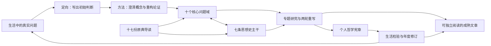

# 学习导航：从一个问题走完整个哲学循环

这张导航不增加新的必修内容，只解决一件事：当读者从某个问题、作者或生活困境进入时，怎样在课程、方法、思想史、原典、写作和生活检验之间移动，而不把任何一层当成全部哲学。

## 一、先判断自己站在哪里

| 当前状态 | 从哪里开始 | 这一轮何时停止 |
|---|---|---|
| 只有“想学哲学”，还没有具体问题 | [阶段 0：定向](00-orientation/README.md)，随后完成[十二周起步](00-orientation/twelve-week-launch.md) | 能写出一个可争论问题、一张论证图和一篇真正重写过的短文 |
| 已有一个困扰生活的问题 | 在下方“问题—方法—原典”表中选一行，只运行一个[四周循环](study-workflow.md) | 形成暂时结论，写明最强异议、代价和改变结论的条件 |
| 正在读某位作者，却不知道其历史位置 | 从[七条思想史主干](03-historical-traditions/README.md)进入，再使用对应[原典导读](../reading-guides/README.md) | 能区分原文论证、历史语境、后世解释与自己的判断 |
| 已能写短文，想进入一个专题 | 完成[二十周研究与综合](04-research-and-synthesis/README.md) | 长文经两轮实质重写、来源审计、外部批评和口头答辩 |
| 已有稳定立场，想让哲学进入生活 | 写[个人哲学宪章](04-research-and-synthesis/06-personal-philosophy-constitution.md)，执行[年度修订](04-research-and-synthesis/07-annual-revision-and-life-test.md) | 原则与真实时间、金钱、关系和行动记录完成一次对照，并保留修订版本 |

不确定时从定向开始。阅读速度慢、外语有限或中途暂停，都不会改变完成标准；只改变所需时间。

## 二、完整系统怎样闭环

箭头不是只准向前。读原典时发现问题问错了，应回到问题档案；历史证据推翻比较前提，应重画比较；生活后果暴露原则虚假，应修改宪章而不是替原则辩护。

## 三、从十个问题选择方法、历史与原典

每行只给第一轮的优先连接，不宣称列出的文本足以穷尽问题。所有问题都继续使用[论证与逻辑](01-methods/01-argument-and-logic.md)；表中列的是除此之外最能暴露盲点的方法。

| 问题入口 | 优先方法 | 历史主干 | 已有原典导读入口 |
|---|---|---|---|
| [1. 知识与真理](02-core-problems/01-knowledge-and-truth.md) | [概念分析](01-methods/03-conceptual-analysis.md)、[苏格拉底式反诘](01-methods/02-socratic-inquiry.md) | [古希腊](03-historical-traditions/01-ancient-greek-and-hellenistic.md)、[欧洲近代](03-historical-traditions/05-early-modern-and-enlightenment.md) | [《游叙弗伦》](../reading-guides/ancient-greek/plato-euthyphro.md)、[笛卡尔《沉思集》](../reading-guides/early-modern/descartes-meditations.md)、[休谟《研究》](../reading-guides/early-modern/hume-enquiry.md) |
| [2. 实在、因果与时间](02-core-problems/02-reality-causation-and-time.md) | [概念分析](01-methods/03-conceptual-analysis.md)、[比较哲学](01-methods/08-comparative-philosophy.md) | [印度与佛教](03-historical-traditions/03-indian-and-buddhist.md)、[一神教论辩网络](03-historical-traditions/04-christian-islamic-and-jewish.md)、[欧洲近代](03-historical-traditions/05-early-modern-and-enlightenment.md) | [《中论》](../reading-guides/indian-buddhist/nagarjuna-mmk-selection.md)、[《忏悔录》](../reading-guides/medieval-abrahamic/augustine-confessions-selection.md)、[阿维森纳](../reading-guides/medieval-abrahamic/avicenna-metaphysics-selection.md)、[休谟](../reading-guides/early-modern/hume-enquiry.md) |
| [3. 心灵、自我与意识](02-core-problems/03-mind-self-and-consciousness.md) | [现象学](01-methods/05-phenomenology.md)、[比较哲学](01-methods/08-comparative-philosophy.md) | [印度与佛教](03-historical-traditions/03-indian-and-buddhist.md)、[欧洲近代](03-historical-traditions/05-early-modern-and-enlightenment.md)、[当代与全球](03-historical-traditions/07-contemporary-and-global.md) | [《奥义书》](../reading-guides/indian-buddhist/upanishads-selection.md)、[《无我相经》](../reading-guides/indian-buddhist/early-buddhist-not-self.md)、[笛卡尔](../reading-guides/early-modern/descartes-meditations.md)、[法农](../reading-guides/contemporary-global/fanon-black-skin-white-masks.md) |
| [4. 自由与行动](02-core-problems/04-freedom-and-action.md) | [苏格拉底式反诘](01-methods/02-socratic-inquiry.md)、[现象学](01-methods/05-phenomenology.md)、[谱系与批判](01-methods/07-genealogy-and-critique.md) | [古希腊](03-historical-traditions/01-ancient-greek-and-hellenistic.md)、[十九至二十世纪](03-historical-traditions/06-nineteenth-and-twentieth-century.md) | [亚里士多德](../reading-guides/ancient-greek/aristotle-nicomachean-ethics.md)、[休谟](../reading-guides/early-modern/hume-enquiry.md)、[马克思](../reading-guides/nineteenth-twentieth/marx-selected-works.md)、[波伏瓦](../reading-guides/nineteenth-twentieth/beauvoir-ethics-of-ambiguity.md) |
| [5. 幸福、德性与善的生活](02-core-problems/05-happiness-virtue-and-good-life.md) | [苏格拉底式反诘](01-methods/02-socratic-inquiry.md)、[解释学](01-methods/06-hermeneutics.md)、[比较哲学](01-methods/08-comparative-philosophy.md) | [古希腊](03-historical-traditions/01-ancient-greek-and-hellenistic.md)、[中国与东亚](03-historical-traditions/02-chinese-and-east-asian.md) | [《申辩》](../reading-guides/ancient-greek/plato-apology.md)、[亚里士多德](../reading-guides/ancient-greek/aristotle-nicomachean-ethics.md)、[《论语》](../reading-guides/chinese-east-asian/analects.md)、[《庄子》](../reading-guides/chinese-east-asian/zhuangzi-inner-chapters.md) |
| [6. 道德与价值](02-core-problems/06-morality-and-value.md) | [思想实验与反思平衡](01-methods/04-thought-experiments-and-reflective-equilibrium.md)、[比较哲学](01-methods/08-comparative-philosophy.md) | [古希腊](03-historical-traditions/01-ancient-greek-and-hellenistic.md)、[中国与东亚](03-historical-traditions/02-chinese-and-east-asian.md)、[十九至二十世纪](03-historical-traditions/06-nineteenth-and-twentieth-century.md) | [《游叙弗伦》](../reading-guides/ancient-greek/plato-euthyphro.md)、[亚里士多德](../reading-guides/ancient-greek/aristotle-nicomachean-ethics.md)、[《论语》](../reading-guides/chinese-east-asian/analects.md)、[波伏瓦](../reading-guides/nineteenth-twentieth/beauvoir-ethics-of-ambiguity.md) |
| [7. 权力、正义与共同生活](02-core-problems/07-power-justice-and-common-life.md) | [思想实验与反思平衡](01-methods/04-thought-experiments-and-reflective-equilibrium.md)、[谱系与批判](01-methods/07-genealogy-and-critique.md) | [中国与东亚](03-historical-traditions/02-chinese-and-east-asian.md)、[十九至二十世纪](03-historical-traditions/06-nineteenth-and-twentieth-century.md)、[当代与全球](03-historical-traditions/07-contemporary-and-global.md) | [《论语》](../reading-guides/chinese-east-asian/analects.md)、[马克思](../reading-guides/nineteenth-twentieth/marx-selected-works.md)、[罗尔斯](../reading-guides/contemporary-global/rawls-theory-of-justice.md)、[法农](../reading-guides/contemporary-global/fanon-black-skin-white-masks.md) |
| [8. 语言、解释与理解](02-core-problems/08-language-interpretation-and-understanding.md) | [概念分析](01-methods/03-conceptual-analysis.md)、[解释学](01-methods/06-hermeneutics.md)、[现象学](01-methods/05-phenomenology.md) | [中国与东亚](03-historical-traditions/02-chinese-and-east-asian.md)、[十九至二十世纪](03-historical-traditions/06-nineteenth-and-twentieth-century.md)、[当代与全球](03-historical-traditions/07-contemporary-and-global.md) | [《论语》](../reading-guides/chinese-east-asian/analects.md)、[《庄子》](../reading-guides/chinese-east-asian/zhuangzi-inner-chapters.md)、[维特根斯坦](../reading-guides/nineteenth-twentieth/wittgenstein-philosophical-investigations.md)、[法农](../reading-guides/contemporary-global/fanon-black-skin-white-masks.md) |
| [9. 科学、宗教与世界图景](02-core-problems/09-science-religion-and-worldviews.md) | [解释学](01-methods/06-hermeneutics.md)、[比较哲学](01-methods/08-comparative-philosophy.md) | [印度与佛教](03-historical-traditions/03-indian-and-buddhist.md)、[一神教论辩网络](03-historical-traditions/04-christian-islamic-and-jewish.md)、[欧洲近代](03-historical-traditions/05-early-modern-and-enlightenment.md) | [《奥义书》](../reading-guides/indian-buddhist/upanishads-selection.md)、[《游叙弗伦》](../reading-guides/ancient-greek/plato-euthyphro.md)、[《忏悔录》](../reading-guides/medieval-abrahamic/augustine-confessions-selection.md)、[阿维森纳](../reading-guides/medieval-abrahamic/avicenna-metaphysics-selection.md)、[休谟](../reading-guides/early-modern/hume-enquiry.md) |
| [10. 美、技术、自然与未来](02-core-problems/10-beauty-technology-nature-and-future.md) | [现象学](01-methods/05-phenomenology.md)、[谱系与批判](01-methods/07-genealogy-and-critique.md)、[思想实验与反思平衡](01-methods/04-thought-experiments-and-reflective-equilibrium.md) | [中国与东亚](03-historical-traditions/02-chinese-and-east-asian.md)、[十九至二十世纪](03-historical-traditions/06-nineteenth-and-twentieth-century.md)、[当代与全球](03-historical-traditions/07-contemporary-and-global.md) | [《庄子》](../reading-guides/chinese-east-asian/zhuangzi-inner-chapters.md)、[马克思](../reading-guides/nineteenth-twentieth/marx-selected-works.md)、[罗尔斯](../reading-guides/contemporary-global/rawls-theory-of-justice.md) |

第十个问题域的康德、海德格尔、环境伦理和技术哲学阅读目前由课程直接定位，第一轮十七份导读只提供相邻入口。这一处保留为明确边界，不用不相干文本制造“已经全覆盖”的外观。

## 四、每个问题必须落到什么成果

| 问题 | 本轮必须做出的判断 | 最小书面成果 | 生活或现实检验 |
|---|---|---|---|
| 知识与真理 | 什么把可靠相信变成知识；何种运气会破坏它 | 一条信念的证据链与反例分析 | 审计一条准备转发的重要消息 |
| 实在、因果与时间 | 所用的“存在”“原因”“时间”模型各承担什么 | 用三种因果模型分析同一事件 | 重写一句日常或公共讨论中的“X 导致 Y” |
| 心灵、自我与意识 | 身体、意识、人格连续与自我是否同一问题 | 一个身份变化案例的竞争解释 | 分析记忆、疾病或角色变化后的责任判断 |
| 自由与行动 | 替代可能、来源控制与不受强迫哪项必要 | 一个操控、成瘾或习惯案例 | 记录一周决定的理由、冲动、环境与能力限制 |
| 幸福、德性与善的生活 | 愉快、愿望满足、客观善与德性如何排序 | 对同一人生作四种理论评价 | 对照声称珍视之物与实际时间分配 |
| 道德与价值 | 行动、后果、品格、关系和理由冲突时怎样裁决 | 一份含事实核验的伦理判断 | 追踪一项有限资源决定由谁承担代价 |
| 权力、正义与共同生活 | 一项强制制度能否向受其影响者证明 | 制度备忘录与最强反对意见 | 画出一项政策分配利益、风险与发言权的方式 |
| 语言、解释与理解 | 一个争议词的标准、语境和权力后果 | 同一文本的两种竞争解释 | 追踪一个公共词语怎样改变可说与不可说 |
| 科学、宗教与世界图景 | 经验、模型、证言和超越主张各有何权限 | 一份跨世界图景的证据比较 | 把一项争议拆成事实、概念、推理与价值四层 |
| 美、技术、自然与未来 | 设计选择把哪些价值和未来路径锁入现实 | 设计—环境—代际责任评估 | 审计一项难以逆转的集体技术选择 |

每轮使用[问题档案](templates/question-dossier.md)、[阅读卡](templates/reading-card.md)、[论证图](templates/argument-map.md)、[对话记录](templates/dialogue-record.md)和[短论文工作稿](templates/paper-workshop.md)。成果格式可以变化，但不能省略初始判断、文本证据、异议和修订。

## 五、从七条历史主干进入十七份导读

| 历史主干 | 第一轮锚点导读 | 这一条历史训练必须额外恢复的内容 |
|---|---|---|
| [古希腊与希腊化](03-historical-traditions/01-ancient-greek-and-hellenistic.md) | [《申辩》](../reading-guides/ancient-greek/plato-apology.md)、[《游叙弗伦》](../reading-guides/ancient-greek/plato-euthyphro.md)、[《尼各马可伦理学》](../reading-guides/ancient-greek/aristotle-nicomachean-ethics.md) | 城邦法庭、哲学学校、片段保存与希腊—阿拉伯—拉丁传承 |
| [中国与东亚](03-historical-traditions/02-chinese-and-east-asian.md) | [《论语》](../reading-guides/chinese-east-asian/analects.md)、[《庄子·内篇》](../reading-guides/chinese-east-asian/zhuangzi-inner-chapters.md) | 复合成书、注疏正典、佛教翻译及朝鲜、日本、越南的重构 |
| [印度与佛教](03-historical-traditions/03-indian-and-buddhist.md) | [《奥义书》](../reading-guides/indian-buddhist/upanishads-selection.md)、[《无我相经》](../reading-guides/indian-buddhist/early-buddhist-not-self.md)、[《中论》](../reading-guides/indian-buddhist/nagarjuna-mmk-selection.md) | 口传与论辩制度、经—论—注层次，以及梵、巴利、汉、藏传播 |
| [基督教、伊斯兰与犹太哲学](03-historical-traditions/04-christian-islamic-and-jewish.md) | [《忏悔录》](../reading-guides/medieval-abrahamic/augustine-confessions-selection.md)、[阿维森纳《形而上学》](../reading-guides/medieval-abrahamic/avicenna-metaphysics-selection.md) | 希腊、叙利亚、阿拉伯、希伯来与拉丁语知识网络，以及哲学—神学制度边界 |
| [欧洲近代与启蒙](03-historical-traditions/05-early-modern-and-enlightenment.md) | [笛卡尔《沉思集》](../reading-guides/early-modern/descartes-meditations.md)、[休谟《研究》](../reading-guides/early-modern/hume-enquiry.md) | 实验共同体、印刷、宗教战争、殖民与“普遍主体”的排除条件 |
| [十九至二十世纪](03-historical-traditions/06-nineteenth-and-twentieth-century.md) | [马克思锚点组](../reading-guides/nineteenth-twentieth/marx-selected-works.md)、[《哲学研究》](../reading-guides/nineteenth-twentieth/wittgenstein-philosophical-investigations.md)、[《模糊性的伦理学》](../reading-guides/nineteenth-twentieth/beauvoir-ethics-of-ambiguity.md) | 工业、帝国、世界大战、流亡、大学与期刊怎样参与方法分岔 |
| [当代与全球](03-historical-traditions/07-contemporary-and-global.md) | [《正义论》](../reading-guides/contemporary-global/rawls-theory-of-justice.md)、[《黑皮肤，白面具》](../reading-guides/contemporary-global/fanon-black-skin-white-masks.md) | 去殖民、社会运动、学科正典、翻译与知识机构怎样重新划定哲学问题 |

导读回答“怎样进入文本”，历史课程回答“文本为何在此处出现并如何被传承”。读完导读而没有历史档案，不能算完成历史主干；做完时间线而不能重构原典论证，也不能通过。

## 六、课程成果何时成为独立文章

问题档案、阅读卡和课程论文首先服务于学习，不必全部公开。只有同时满足以下条件，成果才从 `curriculum/` 的练习逻辑进入 `articles/`：

1. 围绕一个能够独立成立的问题和论点，不依赖“第几周任务”的上下文；
2. 原文、历史说明、研究解释和作者自己的判断可以清楚区分；
3. 最强异议已经改变论证，而不是作为结尾的礼节或防御性免责声明；
4. 来源、版本、译文和事实完成逐项审计；
5. 全文至少经历一次结构重写，读者不需要在多个档案页之间拼接正文。

[《我如何看世界》](../articles/Einstein/how-i-see-the-world.md)示范把正文、思想变化、译词、版本和来源放进一篇自足文章；[《幸福的限度》](../articles/Einstein/the-limits-of-happiness.md)示范从一段原典进入独立问题论述。它们是写作结构的既有实例，不是每篇未来文章必须模仿的风格。

## 七、三种可执行节奏

### 十二周：确认自己是否愿意继续

直接执行[十二周起步课程](00-orientation/twelve-week-launch.md)。它不是完整哲学教育的压缩版，而是一次真实试运行：留下基线、阅读卡、论证图和重写文章，再决定是否承担长期训练。

### 一年：获得独立学习的底座

按五周定向、十二周方法、八个核心问题域和年度综合推进；另留六周给中断、返工和休息。剩余两个问题域移入第二年。不要为了在一年内勾完十项而取消重写。

### 三年：完成第一轮闭环

按[总路线](../articles/Philosophy/the-path-of-philosophy.md)完成十个问题域、七条历史主干、专题研究、个人哲学和年度检验。三年是每周约八小时的估算，不是资格期限；完成以证据而非日历判断。

## 八、怎样证明自己完成了，而不只是看过

复制[学习完成账本](templates/completion-ledger.md)，为每项成果填写实际文件位置、版本和通过日期。阶段结束时同时做三种检查：

1. 用[六项评分](assessment.md)检查文本、概念、论证、异议、比较和修正；
2. 不看笔记完成十五分钟口试，确认知识能够被提取；
3. 随机抽一项旧成果，回到原典核对并写出今天会怎样修改。

若账本显示文件存在，但口试无法解释论证；或评分达标，却从未有批评迫使文本改变，阶段仍未完成。体系的最终成果不是一份结业证，而是能够继续发现、判断和修正问题的人。

## 九、这张导航不声称什么

- 十个问题域是训练用覆盖面，不是哲学全部问题的永恒分类；
- 七条历史主干是第一轮骨架，不是七个彼此封闭的文明容器；
- 十七份导读是进入文本的锚点，不是正典名单，也不代表所有课程原典已有逐部导读；
- 表中的连接是教学路径；除非历史课程给出传承证据，概念相似不能写成思想影响；
- 完成第一轮意味着取得独立继续学习的能力，不意味着哲学已被“学完”。
